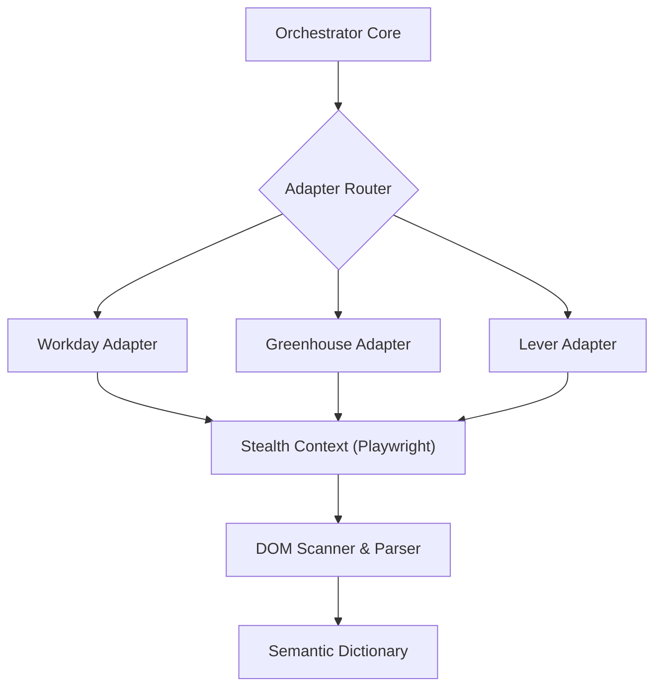

# Automata

[](https://opensource.org/licenses/MIT)
[](https://www.typescriptlang.org/)
[](https://github.com/gorazdatanasovski/automata/releases)

Automata is a high-performance, deterministic automation engine designed for complex, multi-stage web interactions. Engineered to operate across highly variable DOM environments, it utilizes stealth browser contexts and robust state-machine parsers to achieve sub-second execution speeds at scale.

## Architecture



## Key Features

- **Headless Stealth Mode:** Bypasses conventional bot-detection using randomized fingerprinting, CDP (Chrome DevTools Protocol) overrides, and humanized input delays.
- **Deterministic Parsing:** Fails gracefully and recovers via heuristic DOM traversal when structural changes occur in target platforms.
- **Concurrent Execution Pipeline:** Orchestrates multiple parallel browser contexts to maximize throughput while respecting strict rate-limit boundaries.
- **Modular Adapter Architecture:** Extensible design pattern allowing rapid integration of new target platforms via standardized interfaces.

## Quick Start

### Prerequisites
- Node.js 20+
- Docker (optional, for containerized execution)

### Installation
```bash
git clone https://github.com/gorazdatanasovski/automata.git
cd automata
npm ci
```

### Execution
Run the engine natively:
```bash
make run
```
Or use the containerized orchestration layer:
```bash
make docker-run
```

## Documentation
- [Architecture Overview](docs/ARCHITECTURE.md)
- [API Reference](docs/API_REFERENCE.md)
- [Contributing Guidelines](CONTRIBUTING.md)

## License
This project is licensed under the MIT License - see the [LICENSE](LICENSE) file for details.
